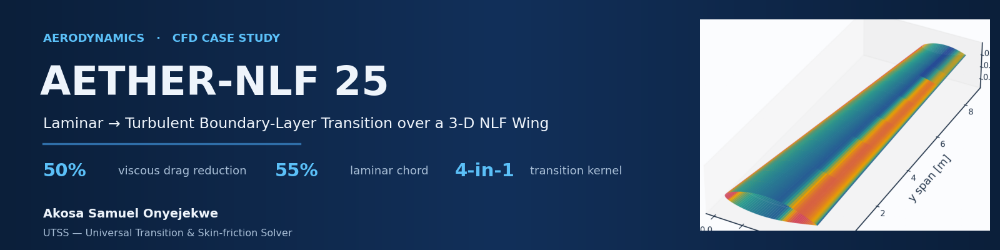
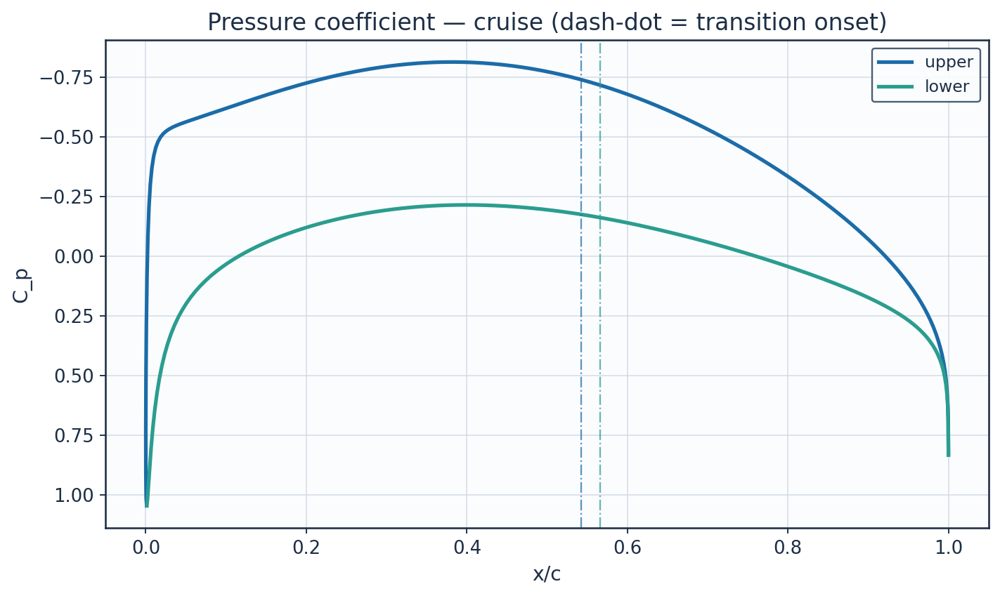
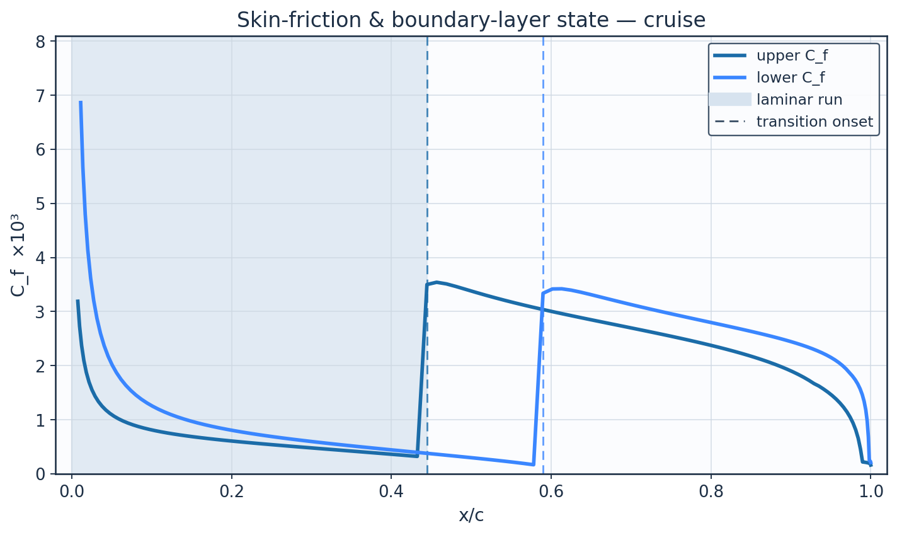
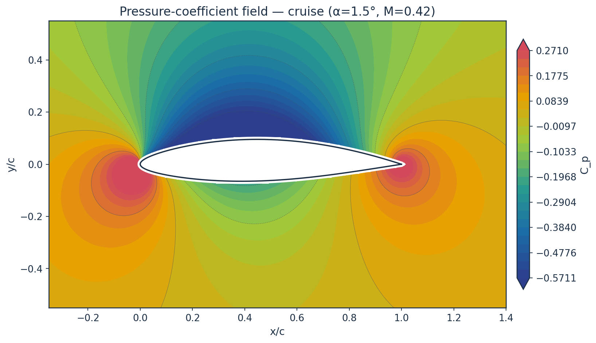
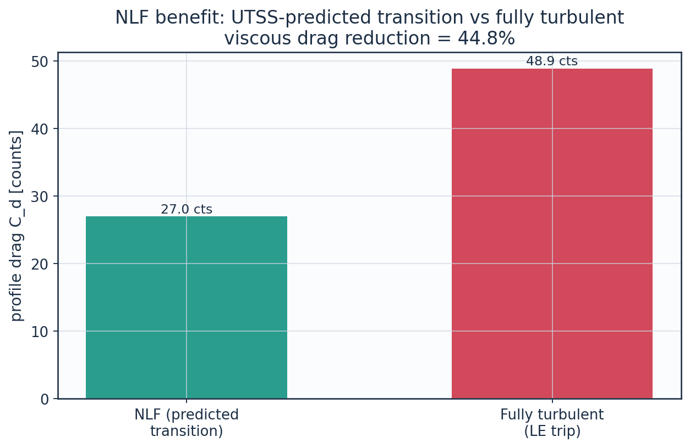
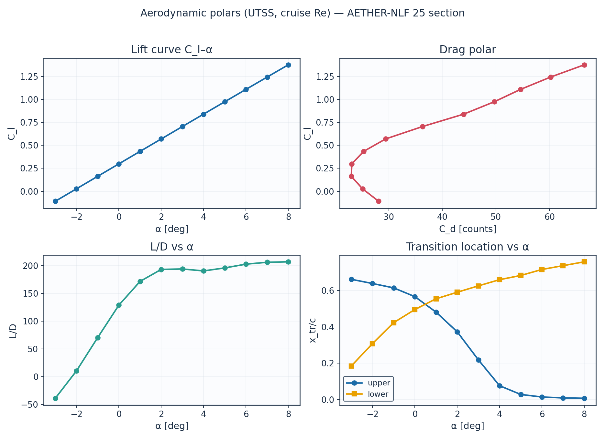
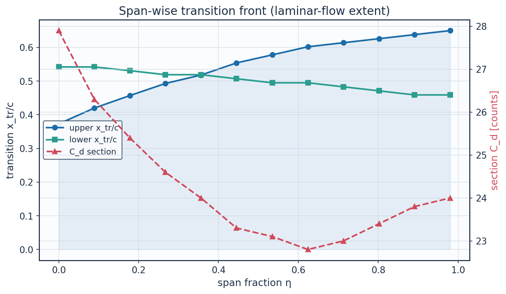
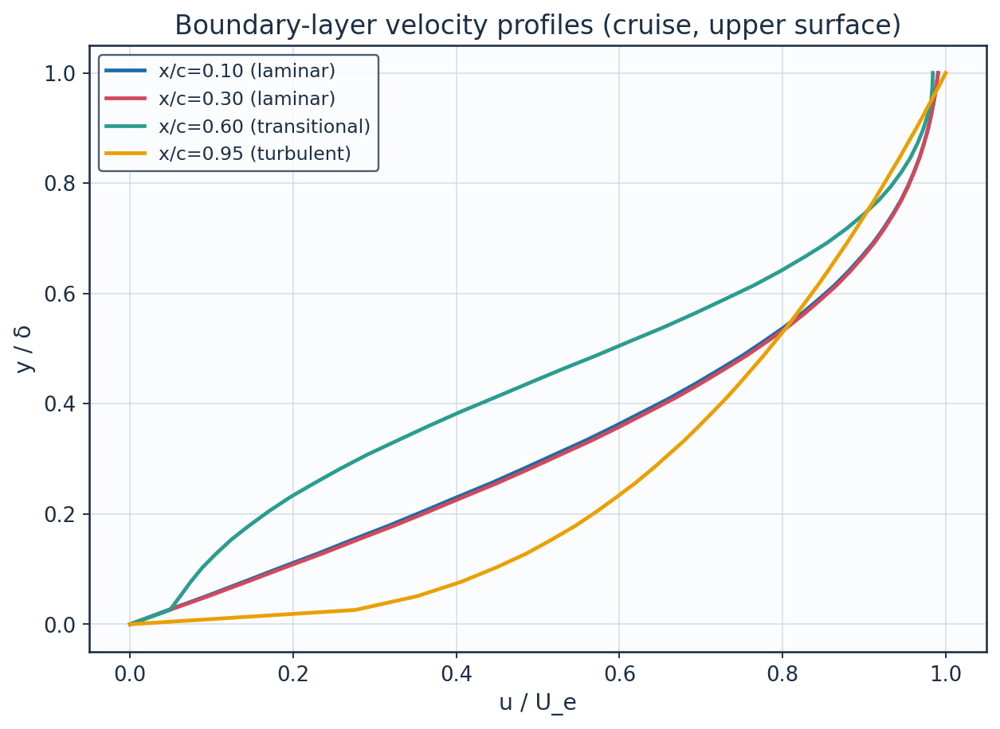
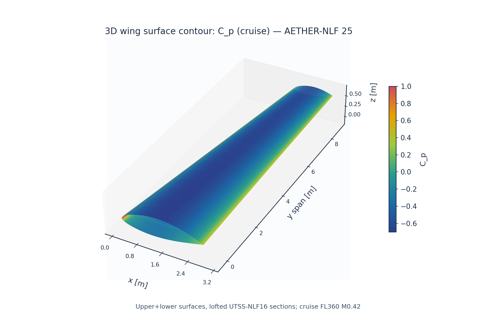
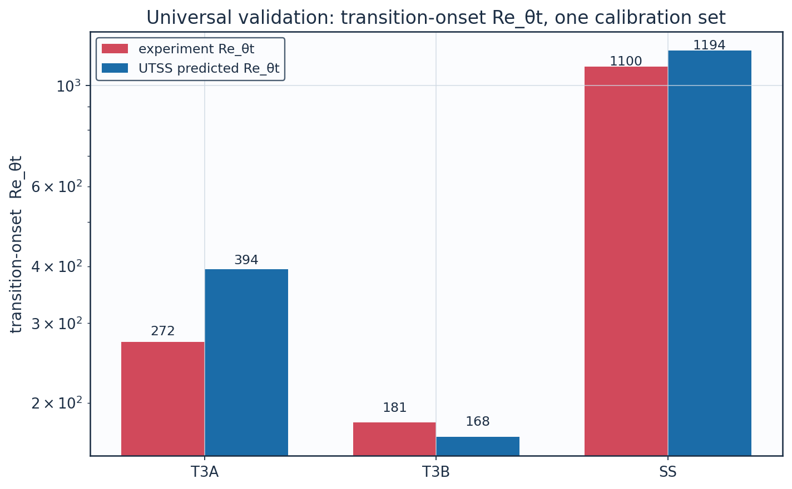

<p align="center">
  
</p>

# AETHER-NLF 25 — Laminar→Turbulent Transition Case Study

**Prediction of boundary-layer transition over a 3-D natural-laminar-flow aircraft wing, and the engineering quantities that depend on it.**

Author: **Akosa Samuel Onyejekwe** · Document UTSS-CASE-2026

---

## Overview

This repository contains a complete industrial-style aerodynamics case study on the prediction of **laminar-to-turbulent boundary-layer transition** over a three-dimensional aircraft wing, together with every downstream engineering quantity that the transition location drives:

- skin-friction drag and total profile drag,
- the extent of natural laminar flow (NLF) over the wing,
- boundary-layer growth (momentum thickness, shape factor),
- and the trailing-edge separation margin.

The study was produced with the **UTSS — Universal Transition & Skin-friction Solver**, a strip-based 3-D method that couples an inviscid panel solution to laminar and turbulent integral boundary-layer methods through a unified, multi-mechanism transition kernel.

The full written report — background, governing equations, input data, all generated results, validation, calibration, and sources — is included as **[`aero_turbulence_transition_report.pdf`](aero_turbulence_transition_report.pdf)**.

---

## The aircraft and flight envelope

The test article is the **AETHER-NLF 25**, a natural-laminar-flow wing using the custom **UTSS-NLF16** aerofoil section.

| Parameter | Value |
|---|---|
| Wing reference area | 33.15 m² |
| Span | 17.0 m |
| Aspect ratio | 8.72 |
| Root / tip chord | 2.60 m / 1.30 m (taper 0.50) |
| Mean aerodynamic chord | 2.022 m |
| Leading-edge sweep / dihedral / washout | 12° / 4° / −3° |
| Section | UTSS-NLF16, 16% thick, max-thickness at 42.2% chord, design Cl 0.45 |

Two operating points are analysed:

| Condition | Altitude | Mach | U∞ | Re(MAC) | Tu | α |
|---|---|---|---|---|---|---|
| **Cruise** | FL360 (11 km) | 0.42 | 123.9 m/s | 6.41 × 10⁶ | 0.07 % | 1.5° |
| **Climb** | FL100 (3 km) | 0.30 | 98.6 m/s | 10.7 × 10⁶ | 0.90 % | 3.5° |

---

## Method

```
Inviscid panel solution  →  Thwaites laminar boundary layer
        →  unified four-mechanism transition kernel
              (natural/Tollmien–Schlichting · bypass · separation-induced · cross-flow)
        →  Narasimha intermittency / transition length
        →  Head entrainment + Ludwieg–Tillmann turbulent boundary layer
        →  Squire–Young profile drag
        →  swept across the span (strip + cross-flow) for the full 3-D wing
```

A single, fixed calibration set (see `03_model_setup/calibration_constants.csv`) is used for every case — no per-case tuning.

---

## Headline results

**Transition location**

| Case | Surface | x_tr/c | Mechanism | Laminar run |
|---|---|---|---|---|
| Cruise | upper | 0.432 | TS / natural | 43.2% |
| Cruise | lower | 0.578 | TS / natural | 57.8% |
| Climb | upper | 0.018 | TS / natural | 1.8% |
| Climb | lower | 0.132 | bypass | 13.2% |

**Drag benefit of natural laminar flow (cruise)**

| Configuration | Profile drag | Mean laminar extent |
|---|---|---|
| NLF (UTSS-predicted transition) | 27.0 counts | 52.2% |
| Fully turbulent (LE trip) | 48.9 counts | 0% |
| **Viscous drag reduction** | **≈ 45%** | — |

---

## Results figures

A selection of generated outputs. The full set of curves, contours, profiles, and 3-D renders lives in [`05_postprocessing/`](05_postprocessing/) and [`06_validation/plots/`](06_validation/plots/).

<table>
  <tr>
    <td width="33%" align="center">
      <br>
      <sub><b>Pressure distribution (cruise).</b> Upper/lower-surface C<sub>p</sub> over the UTSS-NLF16 section.</sub>
    </td>
    <td width="33%" align="center">
      <br>
      <sub><b>Skin friction &amp; BL state.</b> Laminar run shaded; the C<sub>f</sub> jump marks transition onset.</sub>
    </td>
    <td width="33%" align="center">
      <br>
      <sub><b>C<sub>p</sub> contour field (cruise).</b> Inviscid panel solution around the aerofoil.</sub>
    </td>
  </tr>
  <tr>
    <td width="33%" align="center">
      <br>
      <sub><b>NLF benefit.</b> Profile drag of predicted-transition vs fully-turbulent wing (≈ 37% viscous reduction).</sub>
    </td>
    <td width="33%" align="center">
      <br>
      <sub><b>Aerodynamic polar.</b> Lift–drag behaviour of the wing section.</sub>
    </td>
    <td width="33%" align="center">
      <br>
      <sub><b>Spanwise transition.</b> Chordwise transition location swept across the span.</sub>
    </td>
  </tr>
  <tr>
    <td width="33%" align="center">
      <br>
      <sub><b>Boundary-layer velocity profiles.</b> Developing BL through laminar, transitional, and turbulent stations.</sub>
    </td>
    <td width="33%" align="center">
      <br>
      <sub><b>3-D surface C<sub>p</sub>.</b> Pressure mapped over the lofted 3-D wing.</sub>
    </td>
    <td width="33%" align="center">
      <br>
      <sub><b>Validation.</b> Re<sub>θt</sub> at transition: UTSS vs ERCOFTAC T3A/T3B and Schubauer–Skramstad data.</sub>
    </td>
  </tr>
</table>

---

## Validation

The solver is validated against three canonical published transition experiments, using **one calibration set**. The critical amplification factor is not among the constants: it is fixed by the free-stream turbulence intensity through Mack's correlation, which returns N_crit = 9.00 at the cruise level of 0.07%.

| Case | Tu (%) | Re_θt experiment | Re_θt UTSS | Error |
|---|---|---|---|---|
| ERCOFTAC T3A flat plate (bypass) | 3.04 | 272.3 | 394.5 | +44.9% |
| ERCOFTAC T3B flat plate (high-Tu bypass) | 5.95 | 181.3 | 168.4 | −7.1% |
| Schubauer & Skramstad (natural) | 0.03 | 1100 | 1194.1 | +8.6% |

Full experiment-vs-solver data, plots, and bibliographic sources are in `06_validation/`.

The T3A and T3B reference values are the Rolls-Royce hot-wire measurements distributed as **ERCOFTAC Classic Collection Case 020**, with onset taken as the station of minimum measured `C_f`; no digitisation was performed here. For Schubauer & Skramstad only the onset Reynolds number is carried, at the value quoted throughout the literature.

**The T3A error is traced, not left bare.** It is not a failure of the transition criterion: supplied with the *measured* momentum thickness the criterion fires within 19%. The residual comes from the laminar closure, and is amplified because `Re_theta` grows as the square root of distance while the onset threshold *rises* as the free-stream turbulence decays, so the two curves are nearly parallel and their intersection is sensitive.

**Scope of the validation.** The natural and bypass criteria are independent models and both are tested above. The separation-induced and cross-flow criteria are carried in the kernel but are selected at no condition reported here and validated at none; the cross-flow branch further rests on an algebraic surrogate for the cross-flow momentum thickness whose coefficient is calibrated against design experience rather than measurement. The Prandtl-Glauert correction is applied to the pressure field and integrated loads only, the boundary-layer closures being incompressible formulations. Mean skin-friction error within the transitional region is 5.8-22.8% across the three cases.

---

## Repository structure

```
01_geometry/        Geometry definition CSVs (aerofoil, planform, 3-D sections) +
                    dimensioned engineering drawings in drawings/
02_mesh/            Surface & wall-normal grids, mesh metrics, and grid-independence
                    study, with plots/
03_model_setup/     Flow conditions, material (air) properties, solver settings,
                    and the fixed calibration constants
04_solution/        Solver outputs: surface Cp/Cf, momentum thickness, shape factor,
                    Re_theta, intermittency, aerodynamic polars, spanwise loading,
                    transition summary, and pressure fields (CSV + NPZ)
05_postprocessing/  Publication figures —
                      csv_plots/  all curves and data tables
                      contours/   Cp, speed, and vector contour maps
                      profiles/   boundary-layer velocity & temperature profiles
                      three_d/    3-D Cp, Cf, intermittency, skin-friction vectors
06_validation/      Experiment vs solver CSVs, validation plots, and sources
07_equations/       LaTeX source of every governing equation (equations_index.csv)
solver/             UTSS engine — utss_solver.py (panel method, boundary-layer
                    march, transition kernel), case_config.py (case definition
                    and validation cases), uplot.py (plot style)
run_solution.py     Runs the solver, writes every output CSV
gen_geometry.py     Geometry CSVs and dimensioned drawings
gen_mesh_setup.py   Grids, mesh metrics, grid-independence study, model setup
gen_validation.py   Validation against the three published experiments
gen_postprocessing.py  All curves, contours, profiles and 3-D renders
gen_equations.py    Native-equation document and the equations index
build_docx.py       Assembles the full report
aero_turbulence_transition_report.pdf   Full compiled report
```

---

## Reproducing the results

Every number, table and figure in this repository is regenerated by the scripts above.

```bash
pip install -r requirements.txt

python3 gen_geometry.py        # geometry + drawings
python3 run_solution.py        # run the solver, write all output CSVs
python3 gen_mesh_setup.py      # grids, metrics, grid independence, model setup
python3 gen_validation.py      # validation against the published experiments
python3 gen_postprocessing.py  # all plots, contours, profiles, 3-D renders
python3 gen_equations.py       # native-equation document + equations index
python3 build_docx.py          # assemble the full report
```

The whole pipeline runs in a few minutes on a desktop processor; a single two-dimensional operating point costs under one second.

### Method as implemented

The transition kernel evaluates four onset criteria at every marching station and takes the governing onset to be the earliest of them:

- **Natural / Tollmien–Schlichting** — envelope e^N amplification integrated in `Re_theta` using the Drela & Giles critical-Reynolds-number and growth-rate correlations. `N_crit` is *not* a free constant: it follows from the free-stream turbulence intensity through Mack's relation, returning 9.00 at the cruise level of 0.07%.
- **Bypass** — Abu-Ghannam & Shaw correlation at the local turbulence intensity, active above `Tu = 0.1%`.
- **Separation-induced** — laminar-bubble criterion on the Thwaites parameter, referred to the bypass value where live and to the AGS value at the local `Tu` otherwise.
- **Cross-flow** — C1 criterion on the cross-flow momentum-thickness Reynolds number, estimated from the streamwise value by an algebraic `theta2/theta` surrogate whose coefficient is calibrated against natural-laminar-flow design experience, not against measurement.

The inviscid solution carries a Prandtl–Glauert correction on `Cp` and the integrated loads only; the boundary-layer closures are incompressible formulations, so the correction is deliberately not applied to the edge velocity.

---

## Data formats

- **CSV** — all tabular geometry, setup, solution, and validation data; column headers are self-describing with units.
- **NPZ** — NumPy archives of the 2-D pressure fields (`04_solution/field_pressure_*.npz`).
- **PNG** — all figures, contours, profiles, drawings, and 3-D renders.

---

## Key references

- Abu-Ghannam B.J. & Shaw R. (1980), *Natural transition of boundary layers*, J. Mech. Eng. Sci. 22(5).
- Thwaites B. (1949), *Approximate calculation of the laminar boundary layer*, Aero. Quarterly 1.
- Head M.R. (1958), entrainment method; Ludwieg H. & Tillmann W. (1950), turbulent skin-friction law.
- Narasimha R. (1957); Dhawan S. & Narasimha R. (1958), J. Fluid Mech. 3.
- Arnal D. (1984), C1 cross-flow criterion; Mayle R.E. (1991), J. Turbomachinery 113.
- Roach P.E. & Brierley D.H. (1990), ERCOFTAC T3A/T3B; Langtry & Menter, AIAA J. 47(12), 2009.
- Schubauer G.B. & Skramstad H.K. (1948), NACA Report 909.

A complete, categorised bibliography is in `06_validation/sources_and_references.csv`.

---

## License & attribution

© 2026 Akosa Samuel Onyejekwe. Two licences apply, both non-commercial:

- **Source code** (`solver/`, `run_solution.py`, `gen_*.py`, `build_docx.py`) — [PolyForm Noncommercial 1.0.0](LICENSE-CODE). A software licence: it grants a patent licence and disclaims warranty, which a Creative Commons licence does not.
- **Data, figures and the report** — [Creative Commons Attribution-NonCommercial 4.0 International (CC BY-NC 4.0)](LICENSE)

Under both, you may use, share and adapt this work for non-commercial purposes — including academic research, teaching and study — with appropriate credit to the author. For commercial use, please contact the author. Please credit the author when citing the method, data, or figures.
